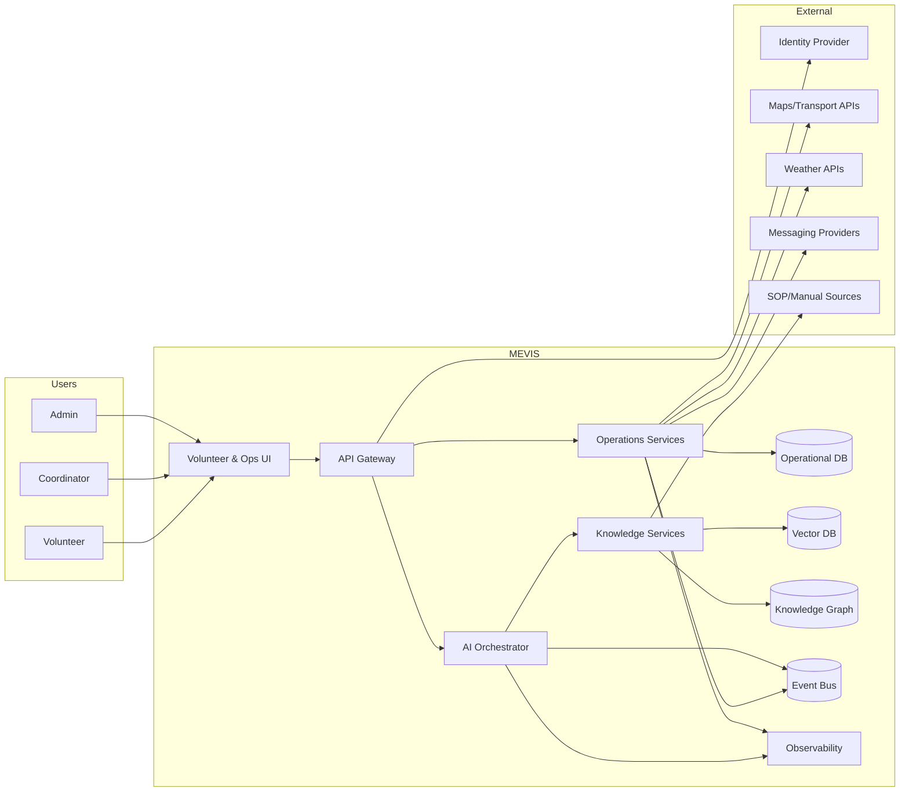
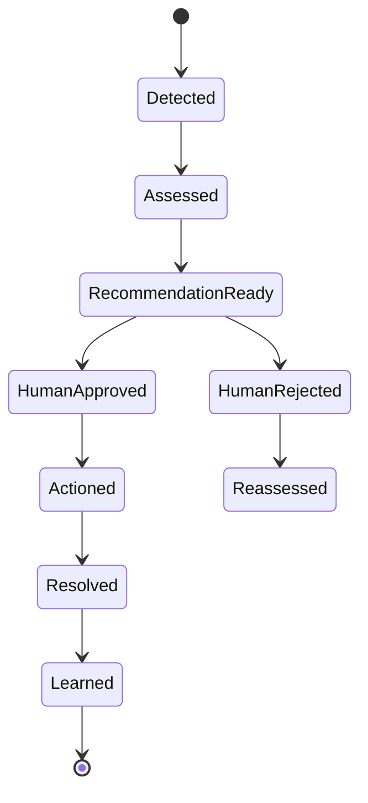

# MEVIS Architecture Specification v1.0

Status: Draft  
Owner: MEVIS Architecture Group  
Last Updated: 2026-07-18  
Authority: Subordinate to [MEVIS Engineering Constitution](../engineering/MEVIS%20Product%20Constitution.md) and [Product Vision](../product/Product%20Vision%20doc%20v1.0.md)
 
---
 
## 1. Purpose
 
This document defines the platform architecture for MEVIS as an AI-native operational intelligence system for mega-event volunteer operations.
 
It covers system boundaries, service decomposition, data architecture, API boundaries, event architecture, security controls, deployment topology, and evolution path from hackathon MVP to production. For AI reasoning behaviors, refer to the [AI Reasoning Specification](../reasoning/MEVIS%20AI%20Reasoning%20Specification%20v1.0.md).

---

## 2. Scope and Non-Scope

### 2.1 In Scope

- Volunteer decision support interfaces
- Incident intelligence and operational workflows
- AI orchestration, context assembly, retrieval, and explainability
- Human-in-the-loop approvals for safety-impacting actions
- Operational and AI observability
- Security, policy enforcement, and auditability

### 2.2 Out of Scope

- Ticketing, payroll, recruitment, and HR workflows
- Autonomous control of safety-critical infrastructure
- Replacing emergency command authority

---

## 3. Architecture Principles

1. Context before conversation
2. Reason before recommendation
3. Explainability by default
4. Human authority override at all times
5. Safety over optimization
6. Event-driven operational awareness
7. API-first modular design
8. Evolutionary architecture (MVP to production)

---

## 4. System Context



---

## 5. Logical Bounded Contexts

| Context | Responsibility | Key Interfaces |
|---|---|---|
| Volunteer Experience | Querying support, action acknowledgement, multilingual UX | `/v1/assistant`, `/v1/actions` |
| Operations Command | Incident triage, escalation, prioritization | `/v1/incidents`, `/v1/escalations` |
| AI Intelligence | Orchestration, reasoning pipeline, recommendation assembly | `/v1/ai/recommend` |
| Context Engine | Canonical context object construction | `/v1/context/assemble` |
| Knowledge Layer | Ingestion, indexing, retrieval, citations | `/v1/knowledge/*` |
| World State Layer | Live operational state model and diffs | `/v1/world-state/*` |
| Policy & Trust | Policy validation and trust gating | `/v1/policy/validate`, `/v1/trust/score` |
| Notifications | Push/SMS/WhatsApp delivery and retries | `/v1/notifications/*` |
| Admin & Governance | Policies, thresholds, role mappings, model settings | `/v1/admin/*` |
| Analytics & Learning | MTOR, quality metrics, learning loop | `/v1/analytics/*` |

---

## 6. Core Data Architecture

| Store | Purpose |
|---|---|
| Operational DB (Postgres) | Source of truth for incidents, users, approvals, actions |
| Vector DB | Semantic retrieval over SOPs, reports, memory |
| Knowledge Graph | Stable relationship reasoning across entities |
| Cache (Redis) | Low-latency context fragments, idempotency, rate limits |
| Object Store | Raw documents and evidence artifacts |
| Decision Graph Store | Immutable reasoning traces for audit/explainability |
| Evaluation Store | Per-request quality and policy metrics |
| Analytics Warehouse | MTOR and operational KPI reporting |

---

## 7. Event Architecture

Events are first-class and immutable. Every state transition emits a domain event.

### 7.1 Event Domains

- Volunteer events
- Incident events
- AI pipeline events
- Policy/trust events
- Notification events
- System health events

### 7.2 Incident State Machine



---

## 8. API Architecture

### 8.1 External API Style

- JSON over HTTPS
- Versioned paths (`/v1/...`)
- Trace IDs required in headers
- Structured error envelopes:

```json
{
  "error": {
    "code": "POLICY_DENIED",
    "message": "Action violates safety policy",
    "trace_id": "trc_123",
    "retryable": false
  }
}
```

### 8.2 Authentication and Authorization

- OIDC/OAuth2 for identity
- JWT access tokens
- RBAC + ABAC for role and venue-scope control

---

## 9. Security and Compliance Controls

- Encryption in transit (TLS 1.2+) and at rest (KMS-backed)
- Secret manager only; no static credentials in code
- Prompt injection filtering before and after model calls
- Signed audit logs for recommendations, approvals, and overrides
- Data minimization and retention windows for PII
- Rate limits per role, user, and IP

---

## 10. Deployment Topology

### 10.1 Hackathon MVP

- Modular monolith services in containers
- Managed Postgres + vector extension
- Redis cache + simple event stream
- Single region deployment
- Managed observability stack

### 10.2 Production Evolution

- Extract services per bounded context
- Dedicated message broker
- Multi-region read resilience
- Policy service and trust gate as independent control-plane services
- Strong DR/BCP and SLO-driven operations

---

## 11. Architecture Decision Summary

| ADR | Decision |
|---|---|
| ADR-001 | Context assembly is mandatory before reasoning |
| ADR-002 | Human approval is required for safety-impacting actions |
| ADR-003 | Hybrid retrieval (vector + keyword + graph) |
| ADR-004 | Decision graph is mandatory for every recommendation |
| ADR-005 | Policy and trust are independent gates |
| ADR-006 | Event-driven operational model |
| ADR-007 | Modular monolith for MVP, service extraction later |

---

## 12. MVP Cut Line

### Must Have

- Incident lifecycle and eventing
- Context assembly + grounded recommendation + citations
- Policy validation + trust gating
- Human approval workflow
- Audit logging and baseline observability

### Deferred

- Full multi-region resilience
- Advanced predictive simulation optimization
- Autonomous orchestration without human checkpoints

---

## 13. Compliance Checklist

- Aligns to AI-native invariant
- Preserves human authority
- Grounds recommendations in evidence
- Enforces safety precedence
- Supports explainability and learning loop

