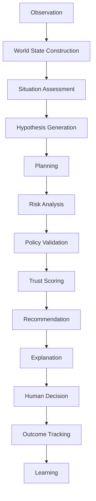
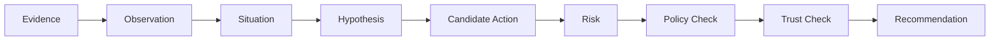

# MEVIS AI Reasoning Specification v1.0

Status: Draft  
Owner: MEVIS AI Architecture Group  
Last Updated: 2026-07-18  
Authority: Subordinate to [MEVIS Engineering Constitution](../engineering/MEVIS%20Product%20Constitution.md) and [Product Vision](../product/Product%20Vision%20doc%20v1.0.md)

---

## 1. Purpose

This specification defines the normative AI reasoning architecture for MEVIS.

It establishes the canonical cognitive loop, context schema, world-state semantics, policy and trust gates, decision graph requirements, memory behavior, multi-agent governance, evaluation harness, and simulation protocol. For platform services and data architecture, refer to the [Architecture Specification](../architecture/MEVIS%20Architecture%20Specification%20v1.0.md).

---

## 2. Normative Language

The key words MUST, MUST NOT, SHOULD, and MAY are to be interpreted as described in RFC 2119.

---

## 3. Constitutional Mapping

| Invariant                           | Reasoning Requirement                                      |
| ----------------------------------- | ---------------------------------------------------------- |
| INV-001 AI-native platform          | Reasoning loop is first-class system behavior              |
| INV-002 Human override              | All high-risk actions require explicit human decision      |
| INV-003 Augment, not replace humans | AI outputs are recommendations, never autonomous commands  |
| INV-004 Grounded evidence           | Recommendation MUST include evidence references            |
| INV-005 Explainability              | Decision graph and explanation payload are mandatory       |
| INV-006 Safety first                | Policy and trust gates can block otherwise optimal actions |
| INV-007 Continuous learning         | Outcomes and overrides MUST update learning records        |

---

## 4. Canonical Cognitive Loop

MEVIS reasoning MUST follow this stage sequence:



### 4.1 Stage Contracts

| Stage                 | Input                          | Output                             |
| --------------------- | ------------------------------ | ---------------------------------- |
| Observation           | Raw events/signals             | Normalized observation objects     |
| World State           | Observations + prior state     | Versioned world-state snapshot     |
| Situation Assessment  | World state + context          | Situation labels and severity      |
| Hypothesis Generation | Situation + evidence           | Plausible scenario hypotheses      |
| Planning              | Hypotheses + constraints       | Candidate action plans             |
| Risk Analysis         | Candidate plans                | Risk vectors and impact estimates  |
| Policy Validation     | Candidate plans + policy set   | Allow/deny/needs-approval          |
| Trust Scoring         | Evidence and quality signals   | Trust score + release verdict      |
| Recommendation        | Validated plans                | Ranked action recommendations      |
| Explanation           | Decision graph                 | Human-readable rationale payload   |
| Outcome Tracking      | Human decision + field outcome | Resolution records                 |
| Learning              | Outcomes + eval records        | Updated memory/knowledge artifacts |

---

## 5. World State Engine

### 5.1 Purpose

The World State Engine (WSE) maintains a continuously updated operational twin of venue conditions.

### 5.2 Requirements

- WSE MUST maintain entity state, relationship state, and confidence values.
- WSE MUST version snapshots (`world_state_version`).
- WSE MUST emit diffs on every material update.
- WSE MUST preserve event provenance and event-time ordering metadata.

### 5.3 World State Schema (Minimum)

```json
{
  "world_state_version": 0,
  "generated_at": "ISO-8601",
  "entities": [],
  "relationships": [],
  "active_incidents": [],
  "resource_status": [],
  "confidence": {
    "overall": 0.0
  },
  "provenance": []
}
```

### 5.4 Failure Handling

- On stale or incomplete state, system SHOULD downgrade trust score.
- On conflicting observations, system MUST retain both claims with source confidence and avoid forced merge without policy.

---

## 6. Ontology and Knowledge Graph

### 6.1 Ontology Requirement

MEVIS MUST maintain a canonical ontology defining:

- entities (Volunteer, Incident, Zone, Gate, Route, Resource, Supervisor, SOP, RiskClass)
- attributes
- relationships
- cardinality and constraints

### 6.2 Knowledge Graph Requirement

Knowledge Graph (KG) MUST represent stable operational relationships and SHOULD support impact traversal queries.

Example:

- `Volunteer assigned_to Gate`
- `Gate located_in Zone`
- `Incident affects Gate`
- `Supervisor manages Volunteer`

### 6.3 KG and RAG Interop

- RAG supplies textual evidence.
- KG supplies relational facts.
- Reasoning stage MUST consume both when available.

---

## 7. Canonical Context Schema

All AI reasoning components MUST consume the same context object.

```json
{
  "context_id": "ctx_*",
  "timestamp": "ISO-8601",
  "user": {},
  "venue": {},
  "operational_state": {},
  "incident": {},
  "policies": [],
  "retrieved_knowledge": [],
  "knowledge_graph_facts": [],
  "memory": {},
  "conversation": {},
  "trust_inputs": {
    "freshness_sec": 0,
    "source_quality": [],
    "coverage": 0.0
  }
}
```

### 7.1 Assembly Rules

- Context Manager MUST assemble context before any model invocation.
- Missing critical fields MUST trigger clarification, escalation, or low-confidence output.
- Context object MUST include provenance metadata for each evidence element.

---

## 8. Retrieval and Grounding Specification

### 8.1 Retrieval Pipeline

1. Query rewrite and intent extraction
2. Metadata filter application
3. Hybrid retrieval (keyword + vector)
4. KG relation fetch
5. Re-ranking
6. Citation and grounding package assembly

### 8.2 Grounding Rules

- Every recommendation MUST reference at least one evidence source.
- Safety-impacting recommendations SHOULD reference at least two independent evidence items.
- If grounding threshold fails, output MUST be downgraded to "insufficient evidence."

---

## 9. Policy Engine

### 9.1 Purpose

Policy Engine evaluates whether candidate actions are permissible and under what constraints.

### 9.2 Policy Domains

- Safety and emergency constraints
- Venue and operational rules
- Role permissions
- Escalation mandates
- Constitutional constraints

### 9.3 Output Contract

```json
{
  "decision": "ALLOW|DENY|REQUIRES_APPROVAL",
  "violations": [],
  "required_escalation": [],
  "policy_version": "pol_*"
}
```

---

## 10. Trust Layer

### 10.1 Purpose

Trust Layer is a hard release gate applied after policy validation.

### 10.2 Trust Signals

- evidence quality
- source diversity
- freshness
- grounding completeness
- confidence calibration
- hallucination risk indicator
- policy compliance status

### 10.3 Trust Actions

- RELEASE
- RELEASE_WITH_WARNING
- BLOCK_AND_ESCALATE

---

## 11. Decision Graph

### 11.1 Requirement

Each recommendation MUST produce an immutable decision graph record.

### 11.2 Node Types

`EVIDENCE | OBSERVATION | SITUATION | HYPOTHESIS | ACTION | RISK | POLICY_CHECK | TRUST_CHECK | RECOMMENDATION`

### 11.3 Usage

- explainability payload generation
- audit and compliance review
- evaluation and replay analysis



---

## 12. Memory Architecture and Write Policies

### 12.1 Memory Types

- Short-term memory (current task)
- Session memory (single shift/session)
- Operational memory (incident outcomes)
- Knowledge memory (curated SOP/lessons)
- Learning memory (evaluation and feedback trends)

### 12.2 Write Policies

- System MUST write session summary at end-of-session.
- System MUST write outcome-linked learning records after incident closure.
- System MUST NOT persist raw sensitive content beyond retention policy.
- Human overrides MUST be stored as high-priority learning events.

### 12.3 Retrieval Policies

- Retrieval SHOULD prioritize recency + relevance + role scope.
- Cross-role memory retrieval MUST be authorization checked.

---

## 13. Multi-Agent Governance Protocol

### 13.1 Required Roles

- Orchestrator (thread owner)
- Specialist agents (incident, SOP, translation, navigation, policy, trust, explainability)

### 13.2 Governance Rules

- Every decision thread MUST have exactly one owner agent.
- Inter-agent calls MUST use a typed message envelope.
- Agent timeouts MUST produce deterministic fallback behavior.
- Conflict between agent outputs MUST be resolved by policy > trust > orchestrator arbitration.

### 13.3 Message Envelope

```json
{
  "message_id": "msg_*",
  "thread_id": "th_*",
  "from_agent": "incident_agent",
  "to_agent": "policy_agent",
  "intent": "validate_actions",
  "payload": {},
  "deadline_ms": 3000,
  "retry_count": 0
}
```

---

## 14. Evaluation Harness

### 14.1 Per-Request Evaluation Record

System MUST persist:

- groundedness
- citation completeness
- policy compliance
- latency
- confidence score
- calibration error
- human override indicator
- user feedback rating

### 14.2 Contract

```json
{
  "decision_id": "dec_*",
  "groundedness": 0.0,
  "citation_completeness": 0.0,
  "policy_compliance": true,
  "latency_ms": 0,
  "confidence": 0.0,
  "calibration_error": 0.0,
  "human_override": false,
  "feedback_score": 0
}
```

### 14.3 Quality Gates

- Build SHOULD fail if regression suite shows critical policy/grounding degradation.
- Deployment SHOULD be blocked for repeated high-severity violations.

---

## 15. Simulation Layer

### 15.1 Purpose

Simulation provides deterministic, replayable scenario streams for validation and demonstrations.

### 15.2 Required Scenarios

- Lost child
- Gate closure
- Severe weather
- Medical emergency
- Transport disruption

### 15.3 Requirements

- Scenario runs MUST be reproducible by run ID and seed.
- Each run MUST output KPI deltas (including MTOR impact).

---

## 16. Explainability Output Contract

All recommendation responses MUST include:

- what happened
- why it matters
- evidence and citations
- confidence
- assumptions
- alternatives
- risks
- recommended action
- human decision required flag

---

## 17. Safety and Human Control

- AI MUST NOT execute safety-critical actions autonomously.
- Human operator decision MUST remain final.
- System MUST allow explicit reject/override with reason capture.
- Safety policy violations MUST be escalated.

---

## 18. Observability and Audit

The reasoning pipeline MUST emit trace spans per stage and bind all outputs to:

- `trace_id`
- `context_id`
- `world_state_version`
- `decision_graph_id`
- `policy_version`

Audit logs MUST be immutable and queryable by incident and decision IDs.

---

## 19. Failure Modes and Required Behavior

| Failure                   | Required Behavior                                     |
| ------------------------- | ----------------------------------------------------- |
| Missing context           | Ask clarifying question or escalate                   |
| Retrieval miss            | Return low-confidence with explicit evidence gap      |
| Policy engine unavailable | Block recommendation release for high-risk flows      |
| Trust gate failure        | Block and escalate                                    |
| Agent timeout             | Deterministic fallback to orchestrator default policy |
| Contradictory evidence    | Surface uncertainty and alternatives                  |

---

## 20. Compliance Checklist

A reasoning implementation is compliant with v1.0 only if it:

1. Implements canonical cognitive loop
2. Uses world state and canonical context schema
3. Applies policy and trust gates before release
4. Persists decision graph and evaluation record
5. Preserves human authority and safety precedence
6. Implements learning write-back from outcomes

---

## 21. Versioning and Change Control

- Schema changes MUST be backward compatible within minor versions.
- Breaking changes require new major version and migration guide.
- Policy, ontology, and prompt artifacts MUST be versioned independently.
